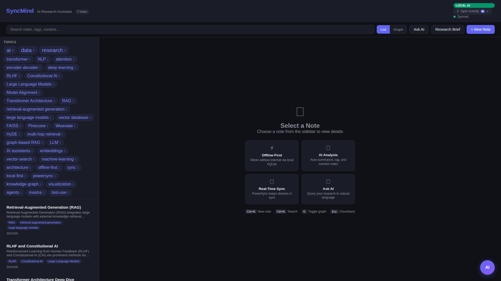
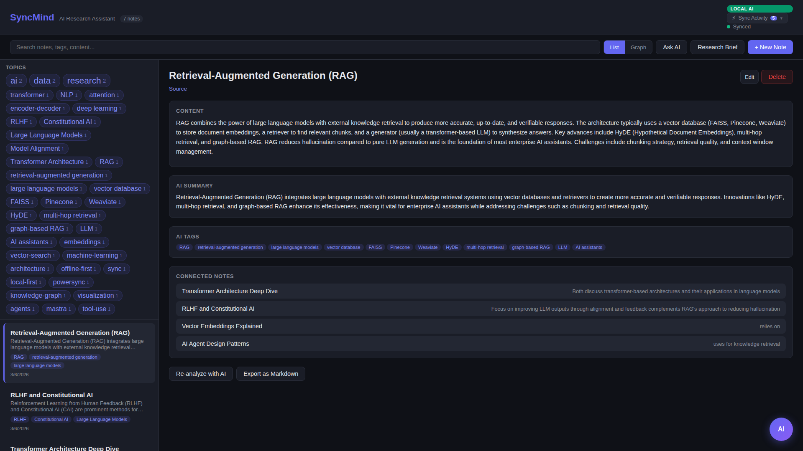
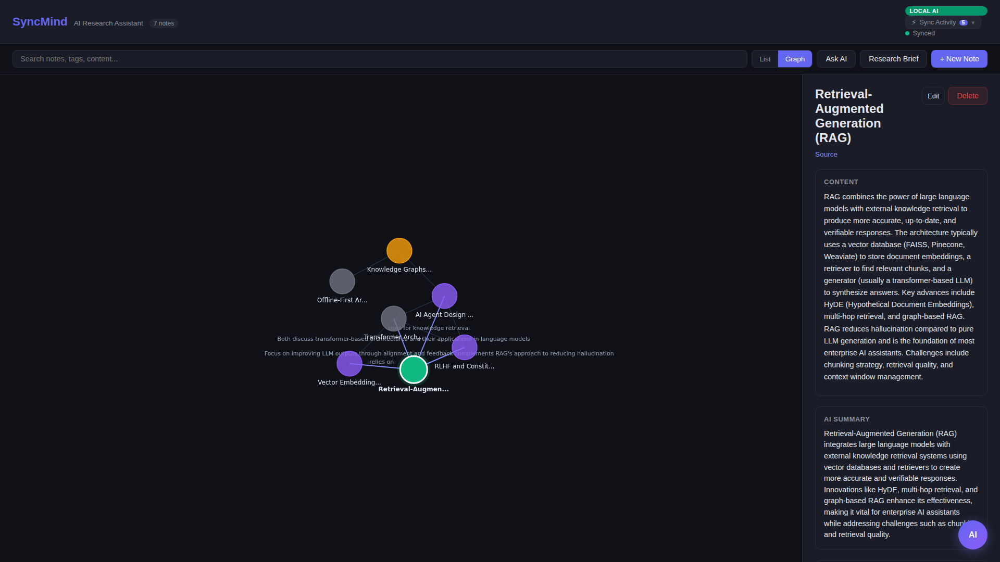
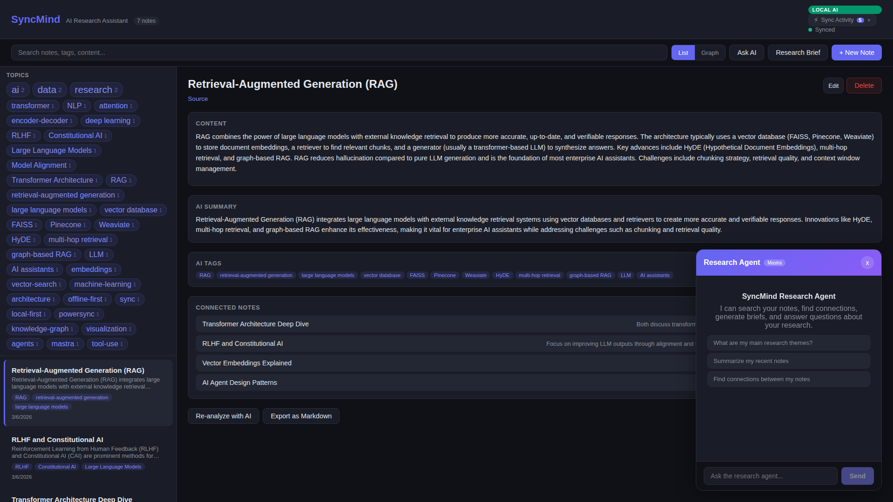
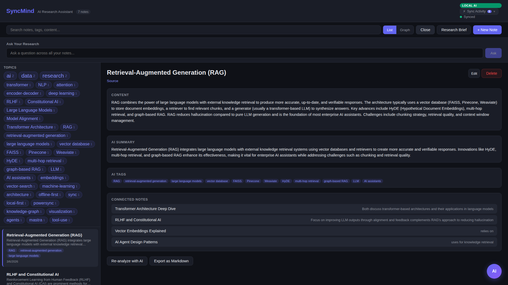
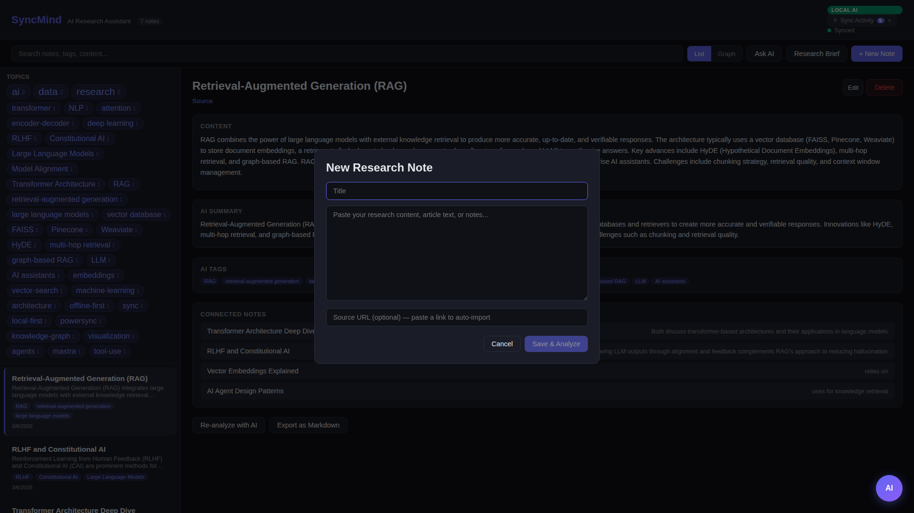

# SyncMind - AI Research Assistant

An offline-first AI research assistant that syncs across devices. Built with PowerSync, React, and Claude AI.

**Works offline. Thinks with AI. Syncs everywhere.**

## Screenshots

| Main View | Note Detail | Knowledge Graph |
|-----------|-------------|-----------------|
|  |  |  |

| Research Agent | Ask AI | New Note |
|----------------|--------|----------|
|  |  |  |

## Features

- **Offline-First**: Create and browse research notes without internet. Changes sync automatically when connectivity returns.
- **AI-Powered Analysis**: Notes are automatically summarized, tagged, and connected by Claude AI (Haiku for fast processing).
- **Knowledge Graph**: Interactive force-directed visualization of note connections. Drag nodes, click to navigate, see relationships on hover.
- **Tag Cloud**: Visual topic frequency display in the sidebar. Click any tag to filter notes instantly.
- **Research Agent Chat**: Conversational AI agent (Mastra-powered) that uses tools to search notes, find connections, and synthesize research.
- **Ask Your Research**: Query across all your notes using natural language.
- **Research Brief**: One-click AI-generated summary across all your notes.
- **Cross-Device Sync**: PowerSync Sync Streams keep data in sync across all connected devices.
- **Local-First Editing**: Full CRUD operations on local SQLite. Edits queue and sync when online.

## Tech Stack

- **Frontend**: React 18 + TypeScript + Vite
- **Sync Engine**: PowerSync (self-hosted) with Sync Streams
- **Backend**: Node.js + Express
- **AI Agent**: [Mastra](https://mastra.ai/) framework with tool-using Research Agent
- **AI Models**: Claude (Anthropic API), OpenAI, or **Ollama** (fully local, no cloud needed)
- **Database**: PostgreSQL (primary) + MongoDB (PowerSync storage)
- **Local Storage**: SQLite (via PowerSync WASM in browser)

## Quick Start

```bash
# 1. Clone and set up
git clone https://github.com/Fulcria-Labs/syncmind.git
cd syncmind

# 2. Configure environment (see .env.example)
cp .env.example .env
# Set ANTHROPIC_API_KEY or OPENAI_API_KEY for cloud AI,
# or leave blank to use Ollama locally (fully offline AI!)

# 3. Start all services (PostgreSQL, MongoDB, PowerSync, Backend)
docker compose up -d

# 4. Install and run frontend
cd frontend && npm install && npm run dev
```

Open http://localhost:5173

### Load Demo Data (Optional)

```bash
# Populate with sample research notes to explore all features
docker compose exec postgres psql -U syncmind -d syncmind -f /docker-entrypoint-initdb.d/seed.sql
```

This loads 6 interconnected research notes covering AI, RAG, embeddings, and more - with pre-computed AI tags, summaries, and a knowledge graph ready to explore.

## Architecture

```
Browser (SQLite via WASM)
    |
    |-- Local reads (instant, offline)
    |-- Local writes (queued offline)
    |
    v
PowerSync Service (Sync Streams)
    |
    |-- Bidirectional sync
    |-- Conflict resolution
    |
    v
PostgreSQL (source of truth)
    ^
    |
Express Backend ----> Mastra Agent ----> AI (Claude/OpenAI/Ollama)
```

### Fully Local Mode (No Cloud APIs)

SyncMind can run entirely locally with [Ollama](https://ollama.ai):

```bash
# Install and start Ollama
ollama pull qwen2.5-coder:7b-instruct-q4_K_M

# Start SyncMind without any API keys - Ollama auto-detected
docker compose up -d
cd frontend && npm install && npm run dev
```

The header shows "LOCAL AI" when using Ollama, making the local-first experience complete: local data (SQLite), local sync (PowerSync), and local AI (Ollama).

## How PowerSync Powers SyncMind

PowerSync is central to the architecture:

1. **Sync Streams** define granular data sync rules per table (notes, connections, tags) with owner-based filtering.

2. **Local SQLite** via `@powersync/web` provides:
   - Instant reads against local database (zero network latency)
   - Full offline CRUD - create, edit, delete notes without connectivity
   - Reactive queries via `useQuery` hooks that auto-update when data changes

3. **Backend Connector** handles JWT authentication, CRUD upload to PostgreSQL, and automatic retry with conflict resolution.

4. **Offline-First UX**: Visual sync status (online/offline/syncing), offline banner, AI features gracefully degrade while core note-taking always works.

## How AI + Sync Work Together

1. User creates a note (writes to local SQLite immediately)
2. PowerSync syncs the note to PostgreSQL
3. Backend detects unprocessed notes via polling
4. Claude AI generates: summary, tags, and connections to related notes
5. AI results written to PostgreSQL
6. PowerSync syncs AI results back to the user's local SQLite
7. UI updates reactively via `useQuery` hooks - no refresh needed

AI processing happens server-side without blocking the user. Results appear automatically across all connected devices.

## Research Agent (Mastra Framework)

The conversational Research Agent uses [Mastra](https://mastra.ai/) with 5 specialized tools for deep research exploration:

- **search-notes**: Find notes by keyword or topic
- **get-note-detail**: Retrieve full note content + connections
- **list-all-notes**: Overview of entire research collection
- **get-tags**: Analyze research themes via tag frequency
- **get-connection-graph**: Map relationships between notes

The agent autonomously chains tools together for complex queries — e.g., "How are my RAG notes connected?" triggers search, detail retrieval, and graph analysis in sequence.

Works with Claude, OpenAI, or fully local Ollama. See [MASTRA_USAGE.md](MASTRA_USAGE.md) for full agent documentation.

## Testing

```bash
# Run all 67 tests (backend + frontend)
npx vitest run

# Backend tests only (36 tests: AI processing, data layer, auth)
cd backend && npm test

# Frontend tests only (31 tests: keyword extraction, schema, sync connector)
cd frontend && npm test
```

## Project Structure

```
syncmind/
  frontend/              # React + TypeScript + Vite
    src/components/
      KnowledgeGraph.tsx  # Force-directed graph visualization
      TagCloud.tsx        # Topic frequency display
      NoteEditor.tsx      # Create new notes
      NoteList.tsx        # Searchable note list
      NoteDetail.tsx      # Full note view with AI insights
      AskAI.tsx           # Natural language Q&A
      AgentChat.tsx       # Mastra-powered research agent chat
    src/lib/
      AppSchema.ts        # PowerSync table definitions
      Connector.ts        # PowerSync backend connector
  backend/               # Express API + Mastra agent + AI processing
  powersync/             # PowerSync service config + sync rules
  db/                    # PostgreSQL schema
  docker-compose.yml     # Full stack orchestration
```

## License

MIT
